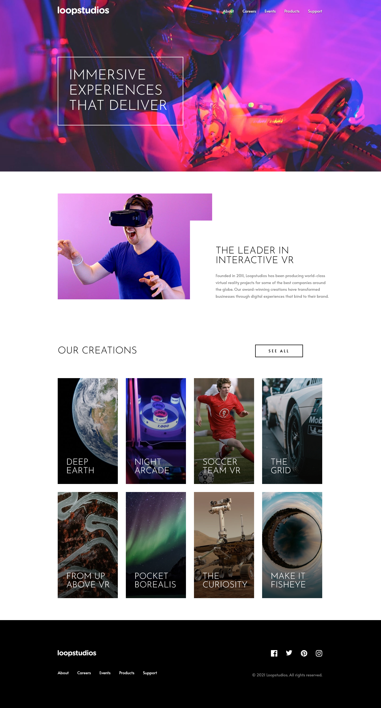

# Frontend Mentor - Loopstudios Landing Page Solution

This is a solution to the [Loopstudios landing page challenge on Frontend Mentor](https://www.frontendmentor.io/challenges/loopstudios-landing-page-N88J5Onjw). Frontend Mentor challenges help you improve your coding skills by building realistic projects. 

## Table of contents

- [Overview](#overview)
  - [The challenge](#the-challenge)
  - [Screenshot](#screenshot)
  - [Links](#links)
- [My process](#my-process)
  - [Built with](#built-with)
  - [What I learned](#what-i-learned)
- [Author](#author)

## Overview

### The challenge

Users should be able to:

- View the optimal layout for the site depending on their device's screen size
- See hover states for all interactive elements on the page

### Screenshot



### Links

- [Solution](https://github.com/Kking927/loopstudios-landing-page)
- [Live Site](https://kking927.github.io/loopstudios-landing-page/)

## My process

### Built with

- Semantic HTML5 markup
- CSS Custom Properties
- Flexbox
- CSS Grid
- Mobile-first workflow

### What I learned

During this project, I focused on integrating high-performance local web fonts and restructuring a dynamic section layout to handle shifting from mobile stacking to a desktop layout grid.

Here are the implementation highlights I'm proud of:

* **Local Custom Fonts via @font-face:** Instead of relying on an external CDN link that can slow down page loading, I learned how to self-host high-performance `.woff2` font files. By declaring them in the stylesheet using `@font-face`, the browser can safely download and swap them into the design system variables without causing invisible text layout shifts.

```css
@font-face {
     font-family: "Josefin Sans";
     src: url("fonts/josefin-sans-v34-latin-300.woff2") format("woff2");
     font-weight: 300;
     font-style: normal;
     font-display: swap;
   }
```

* **Restructuring CSS Grid for Mobile vs. Desktop:** I learned how to structurally isolate a container layout using HTML semantic positioning so that it scales cleanly on different device widths.
    
    On mobile screens, the section wraps all three elements (the header, the card grid, and the button) in a single vertical flex column. On desktop, the layout switches to a CSS Grid matrix where coordinates explicitly tell the header and button to sit side-by-side on Row 1, while stretching the 4-column card grid completely across Row 2.

```css
@media (min-width: 48rem) {
  .creations .container {
    display: grid;
    grid-template-columns: 1fr auto;
    align-items: center;
  }

  .creations__header {
    grid-column: 1;
    grid-row: 1;
  }

  .creations__btn {
    grid-column: 2;
    grid-row: 1;
    justify-self: end;
  }

  .creations__grid {
    grid-template-columns: repeat(4, 1fr);
    grid-column: 1 / -1;
    grid-row: 2;
  }
}
```


 ## Author


- Frontend Mentor - [@Kking927](https://www.frontendmentor.io/profile/Kking927) 
